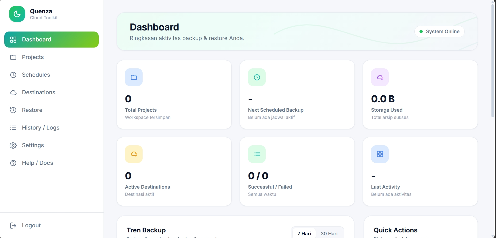
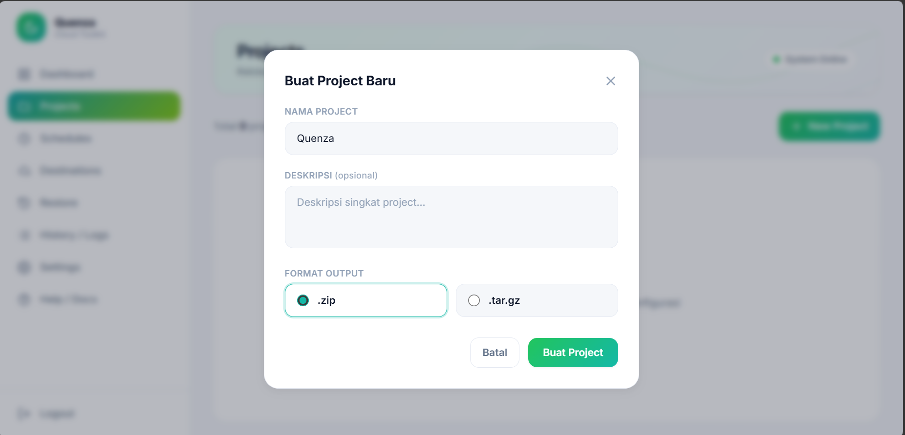
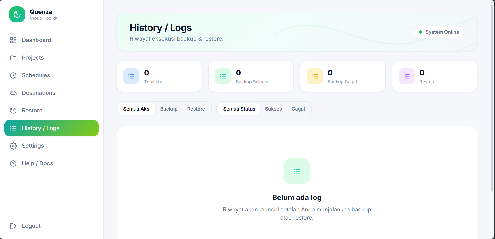
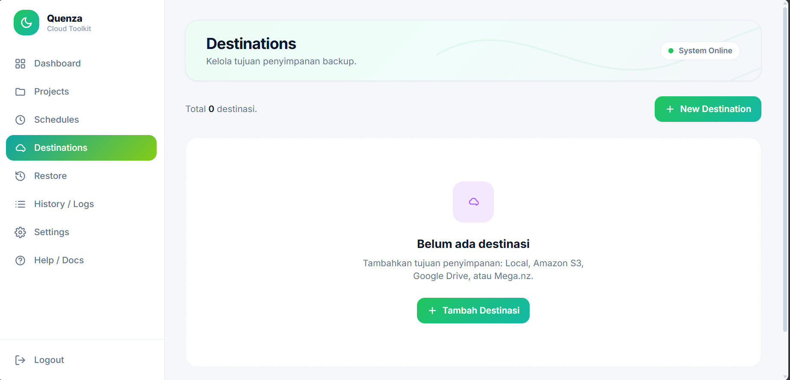
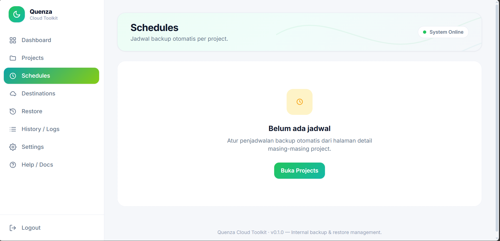
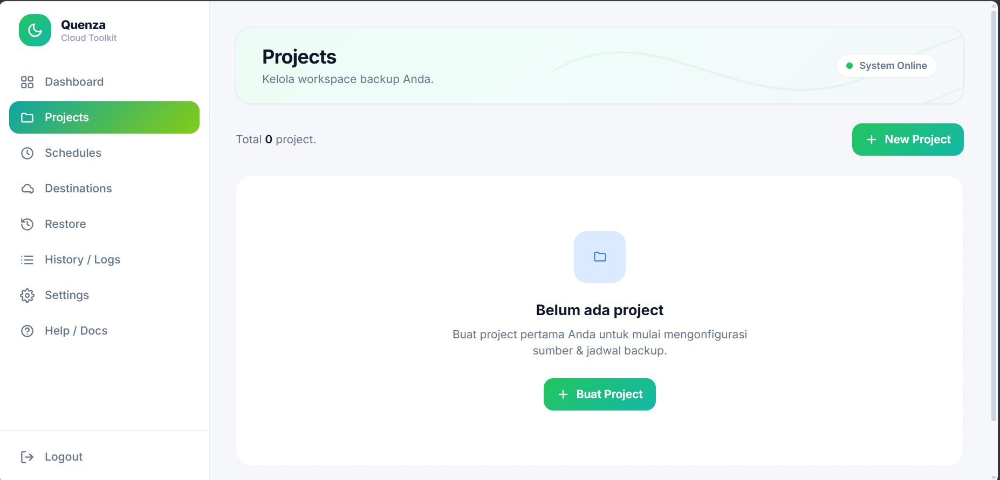
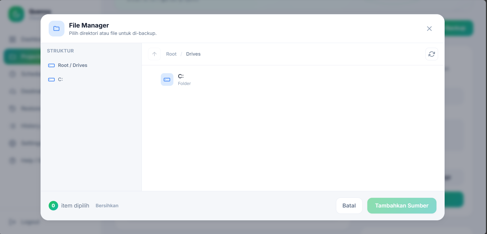

# Quenza Cloud Toolkit

Aplikasi web internal untuk manajemen **backup & restore** data server yang
sederhana, aman, dan terpusat. Mengikuti **Quenza Design System**.

> **Status:** v1 lengkap (Fase 1–5). Autentikasi Master Password tunggal,
> backup multi-sumber, penjadwalan, multi-destinasi (Local/S3/Google Drive),
> serta restore yang aman.

---

## Tampilan Aplikasi

Antarmuka modern, bersih, dan responsif yang mengikuti **Quenza Design
System** — gradasi hijau-teal, kartu rounded, shadow halus, dan animasi
lembut di setiap interaksi. Dirancang agar manajemen backup terasa ringan,
intuitif, dan menyenangkan: dari dashboard yang informatif, manajemen project
yang fleksibel, file manager terintegrasi, multi-destinasi penyimpanan,
penjadwalan otomatis, hingga restore yang aman.















---

## Fitur Utama

- **Autentikasi** Master Password tunggal (hash bcrypt, session cookie).
- **Dashboard** kartu statistik, grafik tren backup, Quick Actions, activity feed.
- **Projects** CRUD + Integrated File Manager (jelajah direktori server).
- **Sumber backup** fleksibel: direktori, file, database MySQL & PostgreSQL.
- **Output** arsip `.zip` atau `.tar.gz` per project.
- **Destinasi**: Local, Amazon S3, Google Drive (OAuth), FTP, SCP/SSH — selektif per project, arsip dirapikan ke sub-folder per project.
- **Penjadwalan** otomatis per project (APScheduler in-process), mengikuti zona waktu global.
- **Backup manual** kapan saja (tombol Run Backup), independen dari jadwal.
- **Restore** pasif & aman (download + extract, proteksi path traversal).
- **History/Logs** dengan filter, paginasi, dan detail.
- **Settings**: zona waktu global + notifikasi (Email atau Telegram) dengan tombol uji kirim.
- **Notifikasi** hasil backup & restore via Email (maks 3 penerima) atau Telegram bot.

---

## Teknologi

| Komponen   | Pilihan                                       |
| ---------- | --------------------------------------------- |
| Backend    | FastAPI + Uvicorn                             |
| Frontend   | Jinja2 + Tailwind CSS (Play CDN) + custom CSS |
| Database   | SQLite (via SQLAlchemy)                       |
| Session    | Signed cookie (Starlette SessionMiddleware)   |
| Auth       | Master Password (bcrypt hash di `.env`)       |
| Scheduler  | APScheduler (BackgroundScheduler)             |
| Cloud      | boto3 (S3), google-api-python-client (Drive)  |
| Transfer   | ftplib (FTP), paramiko (SCP/SFTP)             |
| Notifikasi | smtplib (Email), Telegram Bot API (httpx)     |
| Enkripsi   | cryptography / Fernet (semua kredensial)      |

---

## Prasyarat

- **Python 3.10+** (diuji pada 3.14)
- **pip** dan kemampuan membuat virtual environment (`venv`)
- *(Opsional)* `mysqldump` / `pg_dump` di PATH bila ingin backup database
- *(Opsional)* Akun Google Cloud bila ingin memakai destinasi Google Drive

Cek versi Python:

```bash
python --version    # Linux/macOS
```
```powershell
python --version    # Windows
```

> Di sebagian distro Linux, gunakan `python3` dan `pip3`.

---

## Struktur Project

```
quenza-cloud-toolkit/
├── app/
│   ├── main.py                 # Entry FastAPI (middleware, static, routing, lifespan)
│   ├── config.py               # Konfigurasi dari .env (pydantic-settings)
│   ├── auth.py                 # Verifikasi bcrypt + guard login/API
│   ├── database.py             # Engine SQLite + session
│   ├── models.py               # Model ORM (Project, Source, Destination, Schedule, Log)
│   ├── scheduler.py            # APScheduler in-process
│   ├── templating.py           # Jinja2Templates terpusat
│   ├── routes/                 # auth, page, project, destination, filemanager, history
│   └── services/               # backup, archive, db_dump, restore, log, dashboard,
│       └── destinations/       #   crypto, gdrive_oauth + adapter Local/S3/Drive
├── templates/                  # base, login, dashboard, projects/, destinations,
│                               #   schedules, history, restore, partials/
├── static/                     # css/quenza.css + js/ (app, dashboard, filemanager, ...)
├── generate_hash.py            # Util: generate bcrypt hash Master Password
├── generate_key.py             # Util: generate Fernet ENCRYPTION_KEY
├── requirements.txt
└── .env.example
```

---

## Instalasi Otomatis (Direkomendasikan)

Cara tercepat: jalankan script instalasi yang menangani semuanya
(download → venv → dependencies → `.env` + Master Password → daftarkan
layanan auto-startup → jalankan). Anda cukup menunggu.

**Linux / macOS:**
```bash
curl -fsSL https://raw.githubusercontent.com/teguh02/quenza-cloud-toolkit/main/install.sh | bash
```

**Windows (PowerShell sebagai Administrator):**
```powershell
irm https://raw.githubusercontent.com/teguh02/quenza-cloud-toolkit/main/install.ps1 | iex
```

Detail lengkap, opsi, reverse proxy, dan pengelolaan layanan ada di
[`docs/INSTALL.md`](docs/INSTALL.md).

---

## Setup & Menjalankan (manual, dari awal)

Bila ingin memasang secara manual, langkah berikut tersedia untuk
**Windows (PowerShell)** dan **Linux/macOS (bash)**.

### 1. Clone repository

```bash
git clone https://github.com/teguh02/quenza-cloud-toolkit.git
cd quenza-cloud-toolkit
```

### 2. Buat & aktifkan virtual environment

**Windows (PowerShell):**
```powershell
python -m venv .venv
.\.venv\Scripts\Activate.ps1
```

> Jika muncul error eksekusi script di PowerShell, jalankan sekali:
> `Set-ExecutionPolicy -Scope CurrentUser -ExecutionPolicy RemoteSigned`

**Linux/macOS (bash):**
```bash
python3 -m venv .venv
source .venv/bin/activate
```

### 3. Install dependencies

```bash
pip install -r requirements.txt
```

### 4. Siapkan file `.env`

**Windows:**
```powershell
Copy-Item .env.example .env
```

**Linux/macOS:**
```bash
cp .env.example .env
```

### 5. Generate Master Password hash

```bash
python generate_hash.py
```
Ikuti prompt, lalu salin baris `MASTER_PASSWORD_HASH=...` ke dalam `.env`.

### 6. Generate SECRET_KEY

**Windows:**
```powershell
python -c "import secrets; print('SECRET_KEY=' + secrets.token_urlsafe(48))"
```
**Linux/macOS:**
```bash
python -c "import secrets; print('SECRET_KEY=' + secrets.token_urlsafe(48))"
```
Tempel hasilnya sebagai `SECRET_KEY=...` di `.env`.

### 7. Generate ENCRYPTION_KEY (untuk Google Drive; aman untuk selalu diisi)

```bash
python generate_key.py
```
Salin baris `ENCRYPTION_KEY=...` ke dalam `.env`.

### 8. Jalankan aplikasi

**Windows:**
```powershell
.\.venv\Scripts\uvicorn.exe app.main:app --reload
```
**Linux/macOS:**
```bash
uvicorn app.main:app --reload
```

Buka <http://127.0.0.1:8000> → Anda diarahkan ke halaman login. Masuk dengan
Master Password yang Anda buat di langkah 5.

> **Stop server:** `Ctrl + C`. **Ganti port:** tambahkan `--port 8080`.
> Database `quenza.db` dibuat otomatis saat pertama dijalankan.

---

## Menjalankan untuk Produksi (ringkas)

Gunakan beberapa worker tanpa `--reload`, dan set `DEBUG=false` di `.env`
(agar cookie session hanya via HTTPS):

```bash
uvicorn app.main:app --host 0.0.0.0 --port 8000 --workers 4
```

> **Catatan scheduler:** APScheduler berjalan in-process. Bila memakai banyak
> worker, jadwal dapat ter-trigger lebih dari sekali. Untuk produksi dengan
> banyak worker, jalankan scheduler pada satu instance khusus atau gunakan
> 1 worker untuk proses yang menangani penjadwalan.

---

## Backup Database (opsional)

Backup sumber MySQL/PostgreSQL memanggil `mysqldump` / `pg_dump` lewat subprocess.

**Linux (contoh Debian/Ubuntu):**
```bash
sudo apt-get install mysql-client postgresql-client
```

**Windows:** pasang MySQL/PostgreSQL client tools, lalu (bila tidak di PATH)
set path eksplisit di `.env`:
```
MYSQLDUMP_PATH=C:\Program Files\MySQL\MySQL Server 8.0\bin\mysqldump.exe
PG_DUMP_PATH=C:\Program Files\PostgreSQL\16\bin\pg_dump.exe
```

Jika tool tidak ditemukan, hanya sumber database itu yang ditandai gagal —
backup sumber lain tetap berjalan.

---

## Integrasi Google Drive (OAuth)

Pengguna dapat menghubungkan akun Google Drive masing-masing lewat tombol
**Connect Google Drive** di halaman Destinations. Tiap akun menjadi satu
destinasi yang dapat dipilih per-project. Backup masuk ke Drive akun tersebut.

### Setup di Google Cloud Console
1. Buat project, lalu **Enable** Google Drive API.
2. **OAuth consent screen**: tipe *External*, scope `.../auth/drive.file`,
   tambahkan email Anda sebagai *Test user* (selama app belum diverifikasi
   Google, hanya test user yang dapat connect).
3. **Credentials → Create OAuth client ID → Web application**. Tambahkan
   *Authorized redirect URI* (harus sama persis dengan `GOOGLE_REDIRECT_URI`):
   `http://127.0.0.1:8000/destinations/gdrive/callback`
4. Salin **Client ID** & **Client Secret** ke `.env`.

### Setup di `.env`
```
GOOGLE_CLIENT_ID=xxxx.apps.googleusercontent.com
GOOGLE_CLIENT_SECRET=xxxx
GOOGLE_REDIRECT_URI=http://127.0.0.1:8000/destinations/gdrive/callback
```
Pastikan `ENCRYPTION_KEY` juga sudah diisi (langkah 7). Bila kredensial Google
atau `ENCRYPTION_KEY` belum diisi, tombol *Connect* nonaktif dengan peringatan
(aplikasi tetap berjalan normal untuk destinasi lain).

> **Scope `drive.file`**: aplikasi hanya dapat melihat/mengelola file yang
> dibuatnya sendiri — paling aman & tidak butuh verifikasi Google yang ketat.
> Restore hanya menemukan arsip yang dibuat Quenza.

---

## FTP & SCP/SSH (transfer antar-server)

Selain cloud, hasil backup dapat dikirim ke server lain:

- **FTP** — isi host, port (default 21), user, password, dan direktori tujuan.
  Menggunakan `ftplib` bawaan Python (tanpa dependency tambahan).
- **SCP / SSH** — transfer via SFTP menggunakan `paramiko`. Mendukung
  autentikasi **password** atau **private key** (tempel isi PEM atau path
  file + passphrase opsional).

Kredensial (password, private key, passphrase) disimpan **terenkripsi**
(butuh `ENCRYPTION_KEY`). Keduanya mendukung backup + restore penuh, dan
arsip otomatis dirapikan ke sub-folder per project.

---

## Settings: Zona Waktu & Notifikasi

Buka menu **Settings**:

- **Zona Waktu** — menentukan interpretasi jam penjadwalan dan tampilan waktu
  di seluruh aplikasi. Data tetap disimpan dalam UTC. Mengubah zona waktu
  otomatis menyinkronkan ulang jadwal.
- **Notifikasi** — pilih satu channel:
  - **Email** — konfigurasi SMTP (host/port/user/password/from) + hingga
    **3 email penerima**. Untuk Gmail, gunakan App Password.
  - **Telegram** — token bot dari `@BotFather` + Chat ID tujuan.

Gunakan tombol **Kirim Tes** untuk memverifikasi konfigurasi. Notifikasi
dikirim untuk setiap hasil backup & restore (atau hanya saat gagal, sesuai
pilihan). Kredensial SMTP/Telegram disimpan **terenkripsi** di database
(butuh `ENCRYPTION_KEY`).

---

## Management Console (`toolkit.py`)

Konsol bawaan untuk mengelola instalasi tanpa instal ulang. Jalankan dari
folder instalasi (gunakan Python venv):

```bash
./.venv/bin/python toolkit.py            # menu interaktif (Linux/macOS)
.\.venv\Scripts\python.exe toolkit.py    # Windows
```

Fitur: regenerate/set Master Password, regenerate `SECRET_KEY`/`ENCRYPTION_KEY`,
ubah Public URL, **start/stop/restart/status** layanan + lihat log, ringkasan
konfigurasi, **backup manual** per project, dan **cek & jalankan update** dari
GitHub. Tersedia juga mode CLI, mis.:

```bash
./.venv/bin/python toolkit.py regen-password   # lupa password? buat baru
./.venv/bin/python toolkit.py restart
./.venv/bin/python toolkit.py backup 1
./.venv/bin/python toolkit.py check-update     # cek versi terbaru
./.venv/bin/python toolkit.py update --yes     # update + reinstall deps + restart
```

Lihat detail di [`docs/INSTALL.md`](docs/INSTALL.md).

---

## Troubleshooting

| Gejala | Solusi |
| ------ | ------ |
| PowerShell menolak `Activate.ps1` | `Set-ExecutionPolicy -Scope CurrentUser -ExecutionPolicy RemoteSigned` |
| `uvicorn` tidak dikenali | Pastikan venv aktif, atau panggil `.\.venv\Scripts\uvicorn.exe` (Windows) |
| Port 8000 sudah dipakai | Tambah `--port 8080` (dan sesuaikan `GOOGLE_REDIRECT_URI` bila pakai Drive) |
| `redirect_uri_mismatch` (Google) | URI di Google Console harus sama persis dengan `GOOGLE_REDIRECT_URI` (tanpa trailing slash) |
| `access_blocked` / app not verified | Tambahkan email Anda sebagai **Test user** di OAuth consent screen |
| Tombol Connect Drive nonaktif | Isi `GOOGLE_CLIENT_ID`, `GOOGLE_CLIENT_SECRET`, dan `ENCRYPTION_KEY` di `.env` |

---

## Catatan Keamanan

- Master Password **tidak pernah** disimpan plaintext; hanya hash bcrypt.
- Set `DEBUG=false` di produksi agar cookie session hanya dikirim via HTTPS.
- File `.env`, `*.db`, dan `backups/` sudah di-ignore oleh git.
- Refresh token Google Drive **dienkripsi** (Fernet) sebelum disimpan ke database.
- Restore memproteksi terhadap path traversal (zip-slip / tar-slip).

---

## Roadmap Fase

- [x] **Fase 1** — Inisialisasi & Autentikasi
- [x] **Fase 2** — Dashboard & Navigasi Inti (stat cards, line chart, quick actions)
- [x] **Fase 3** — Manajemen Project & Integrated File Manager
- [x] **Fase 4** — Mesin Backup & Destinations (S3, Google Drive, scheduling)
- [x] **Fase 5** — Restore, Logging & Penyempurnaan

---

## Future Work (Rencana Pengembangan)

Bagian ini mendokumentasikan rencana fitur berikutnya secara detail agar
kontributor lain (manusia maupun AI) dapat melanjutkan dengan konteks penuh.
Status: **belum dikerjakan** (perencanaan). Urutan implementasi yang disarankan:
**FW#3 → FW#1 → FW#2** (FW#3 menjadi fondasi; backup Docker menumpang
mekanisme job FW#3).

### Konteks arsitektur saat ini (penting dipahami dulu)

- **Backup berjalan sinkron** di request handler
  (`app/routes/project_routes.py` → `project_run_backup` memanggil
  `backup_service.run_backup` yang **memblokir** lalu redirect). Scheduler
  (`app/scheduler.py` → `_run_scheduled_backup`) memanggil hal yang sama di
  thread APScheduler.
- **`BackupLog`** (`app/models.py`) ditulis **sekali di akhir** (fungsi
  `_finalize` di `backup_service.py`) — tidak ada state `running`, progres,
  atau langkah. Halaman **History** (`app/routes/history_routes.py`,
  `templates/history.html`) hanya menampilkan riwayat yang sudah selesai.
- Backup memiliki **5 tahap diskret** yang jelas di `backup_service.run_backup`:
  (1) staging dir, (2) kumpulkan sumber + dump DB, (3) buat arsip,
  (4) upload per-destinasi, (5) finalize. Ideal untuk progress reporting.
- **APScheduler `BackgroundScheduler` sudah berjalan** in-process
  (`app/scheduler.py`) — dapat dipakai untuk eksekusi background tanpa
  dependency baru.
- Adapter destinasi modular di `app/services/destinations/` (+ `registry.py`)
  — pola yang sama dipakai untuk menambah "Docker sebagai sumber backup".
- Kredensial sensitif **dienkripsi** via `app/services/crypto.py` (Fernet,
  butuh `ENCRYPTION_KEY`).

---

### FW#3 — Backup di latar belakang + monitoring realtime

**Tujuan:** Backup (via tombol "Backup Sekarang"/"Run Backup" maupun
penjadwalan) berjalan di **latar belakang** (tidak memblokir HTTP request) dan
**termonitor realtime** per-proses lewat menu **History**.

**Keputusan desain:**
- Eksekusi: **in-process background** (ThreadPoolExecutor / APScheduler yang
  sudah ada) — tanpa dependency broker baru.
- Realtime: **polling JSON** tiap 2–3 detik (sederhana, andal di belakang
  reverse proxy; tanpa SSE/WebSocket).
- State job: **tabel baru `backup_jobs`**; `BackupLog` tetap sebagai catatan
  akhir/ringkas.

**Model baru `BackupJob`** (`app/models.py`):
- `id`, `project_id`, `project_name`, `action` (`backup`/`restore`/`docker`),
  `trigger` (`manual`/`schedule`).
- `status`: `queued | running | success | partial | failed | cancelled`.
- `progress` (0–100), `current_step` (teks, mis. "Membuat dump MySQL…",
  "Mengunggah ke S3…"), `total_steps`, `step_index`.
- `steps_json` (riwayat langkah + timestamp + status per langkah), `message`.
- `created_at`, `started_at`, `finished_at`, `log_id` (FK ke `BackupLog` final).

**Eksekusi (service baru `job_service.py`):**
- `enqueue_backup(project_id, trigger)` → buat `BackupJob(status=queued)` →
  submit ke ThreadPoolExecutor terbatas (mis. 2–4 worker) → kembalikan
  `job_id` **segera**.
- Refactor `backup_service.run_backup` agar menerima **callback progress**
  `on_progress(step_index, label, pct)` yang meng-update `BackupJob` di DB pada
  tiap transisi tahap. Logika inti tidak berubah — hanya menambah hook.
- Tombol Run Backup & scheduler memanggil `enqueue_backup` (bukan `run_backup`
  langsung) → request balik **instan** (redirect ke History/detail + `job_id`).
- **Kunci per-project** agar project yang sama tidak di-backup paralel.

**Monitoring di History:**
- Endpoint JSON baru: `GET /api/jobs/active` (daftar job `queued`/`running`)
  dan `GET /api/jobs/{id}` (detail progres + langkah).
- `templates/history.html` ditambah panel **"Proses Berjalan"** di atas tabel
  riwayat: kartu job aktif dengan **progress bar** + langkah saat ini,
  di-refresh `setInterval` fetch tiap 2–3 detik (JS baru `static/js/jobs.js`).
  Job selesai → hilang dari panel aktif, muncul di tabel riwayat.
- Opsional: badge jumlah job aktif di sidebar.

**Batasan & catatan:**
- In-process executor + polling **benar untuk 1 worker uvicorn**. Bila
  `--workers > 1`, perlu **klaim job di level DB** (UPDATE atomik) agar tidak
  dijalankan ganda; polling tetap aman karena membaca DB.
- Job tidak persisten terhadap restart proses: saat startup, lakukan
  **recovery sweep** — tandai job `running` yang terputus menjadi
  `failed/interrupted`.
- Fitur **cancel job** (opsional lanjutan): set flag, dicek antar-tahap.

**Estimasi kompleksitas:** Sedang–Tinggi (refactor `backup_service` + model +
2 endpoint + UI polling).

---

### FW#1 — Docker Management (container, image, volume, network)

**Tujuan:** Modul baru untuk mengelola Docker dari UI Quenza.

**Keputusan desain:**
- **Modul terpisah** (menu "Docker" sendiri), paralel dengan backup.
- Koneksi: **lokal + remote** (TCP/TLS).
- Aksi: **kontrol penuh** (termasuk hapus/prune/create) — dengan konfirmasi
  kuat & audit.

**Dependency baru:** `docker` SDK Python (`pip install docker`). Lazy import +
graceful bila SDK/daemon tidak tersedia (pola sama seperti adapter cloud).

**Model `DockerHost`** (`app/models.py`):
- `name`, `connection_type` (`local`/`tcp`), `base_url`
  (mis. `unix:///var/run/docker.sock` atau `tcp://host:2376`),
- TLS config (cert/key/ca) — **dienkripsi** via `crypto`.

**`docker_service.py`** (wrapper SDK):
- **Containers:** list, inspect, logs, start/stop/restart, remove (konfirmasi),
  create/run (form image + port + env + volume).
- **Images:** list, pull, inspect, remove, prune dangling.
- **Volumes:** list, inspect, create, remove, prune.
- **Networks:** list, inspect, create, remove, prune.

**Routes `docker_routes.py`:** halaman `/docker` dengan tab
(Containers/Images/Volumes/Networks), mutasi via POST+PRG, status live via
endpoint JSON. UI `templates/docker.html` mengikuti Design System Quenza
(badge status running/exited, ikon pastel). Aksi destruktif → modal konfirmasi
(mis. ketik nama container). Tambah item "Docker" di sidebar.

**⚠️ Risiko keamanan (WAJIB diperhatikan):**
- **Akses Docker setara akses root.** Memberi UI kontrol penuh (prune/hapus/
  create) pada aplikasi yang diekspos web sangat berisiko (container escape,
  hapus data produksi). Mitigasi yang direkomendasikan:
  - Aksi destruktif wajib **konfirmasi kuat** + dicatat ke **audit log**.
  - Pertimbangkan toggle **"mode read-only"** di Settings, dan/atau wajib
    masukkan ulang Master Password untuk aksi berbahaya.
  - Remote TCP **wajib TLS** (jangan TCP polos).
  - Socket `/var/run/docker.sock` butuh izin: service Quenza harus di grup
    `docker` atau jalan sebagai root (implikasi keamanan tambahan).
  - Kombinasi bind `0.0.0.0` + Docker full-control + proxy publik = permukaan
    serangan besar → dokumentasikan peringatan + hardening.

**Estimasi kompleksitas:** Tinggi (SDK, model host, 4 sub-modul CRUD, UI tab,
keamanan).

---

### FW#2 — Docker Backup (container & volume)

**Tujuan:** Backup container & volume Docker, memakai mekanisme job background
& monitoring dari FW#3.

**Keputusan desain:** Tipe **sumber backup baru** (selain
directory/file/mysql/postgres):
- **`docker_volume`** — backup isi named volume. Teknik standar: jalankan
  container helper sementara
  (`docker run --rm -v <volume>:/data -v <staging>:/backup alpine tar czf
  /backup/vol.tar.gz -C /data .`), atau via SDK `get_archive` pada container
  yang me-mount volume tersebut.
- **`docker_container`** — `docker export` (tar filesystem) dan/atau
  `docker commit` + `docker image save` (tar image). Pilihan di form
  (export filesystem vs save image).

**Integrasi:**
- Buat `docker_dump_service.py` (sejajar `db_dump_service.py`) untuk menghasilkan
  arsip volume/container ke staging dir.
- Tambah cabang tipe sumber Docker di `backup_service.run_backup` — hasil
  dibungkus ke arsip project dan diunggah ke destinasi seperti biasa
  (konsisten dengan alur yang ada).

**Risiko & catatan:**
- Backup volume "live" tanpa menghentikan container bisa **tidak konsisten**
  (mis. database aktif). Sediakan opsi stop → backup → start, atau peringatan
  konsistensi.
- Ukuran image/volume bisa besar → makin penting eksekusi background (FW#3) +
  progres realtime.
- **Restore** volume: ikuti filosofi restore pasif saat ini (download +
  extract); restore langsung ke volume tujuan dipertimbangkan terpisah.

**Estimasi kompleksitas:** Sedang (bergantung FW#1 untuk SDK/host & FW#3 untuk
job/progres).

---

### Dampak lintas-sistem (untuk ketiga FW)

- **Dependency baru:** `docker` (SDK Python) → update `requirements.txt`,
  `install.sh`/`install.ps1`. Di server Linux butuh akses Docker daemon.
- **Database:** tabel baru `backup_jobs` (FW#3) & `docker_hosts` (FW#1),
  dibuat otomatis via `Base.metadata.create_all`.
- **Keamanan:** kredensial Docker remote dienkripsi (Fernet, butuh
  `ENCRYPTION_KEY`).
- **Reverse proxy:** polling JSON aman tanpa konfigurasi khusus.
- **Multi-worker uvicorn:** perlu job-claiming di level DB bila `--workers > 1`.
- **Verifikasi:** fitur Docker butuh lingkungan ber-Docker untuk uji nyata;
  pada sandbox, uji jalur kode dengan mock + graceful failure dan nyatakan
  batasannya secara jujur.
